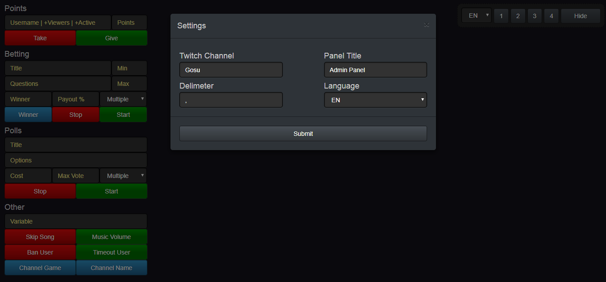
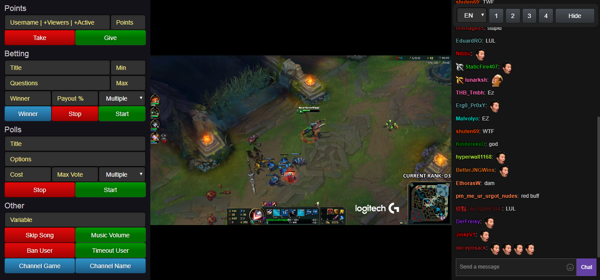

#Twitch Admin Panel

## Functions
- [x] Settings
  - [x] Twitch Channel Name
  - [x] Admin Panel Title
  - [x] Delimeter Changer
  - [x] Language Selector

- [x] Visual
  - [x] Command Panel
  - [x] Twitch Player
  - [x] Twitch Chat
  - [x] Command Panel Size Changer (1/2/3/4)
  - [x] Command Panel Switcher (ON/OFF)
  - [x] Language Selector

## Commands
- [x] [Points]
  - [x] Add Points (Username/Viewers/Active)
  - [x] Remove Points (Username/Viewers/Active)

- [x] [Bettings]
  - [x] Start a bet
  - [x] Stop a bet
  - [x] Announce a winner

- [x] [Polls]
  - [x] Start a poll
  - [x] Stop a poll
  - [x] Announce a winner
  
- [x] [Other]
  - [x] Skip Song
  - [x] Change Song Volume
  - [x] Timeout User
  - [x] Ban User
  - [x] Change Channel Name
  - [x] Change Channel Game

## Screenshots
- [x] Settings Panel

- [x] Admin Panel
